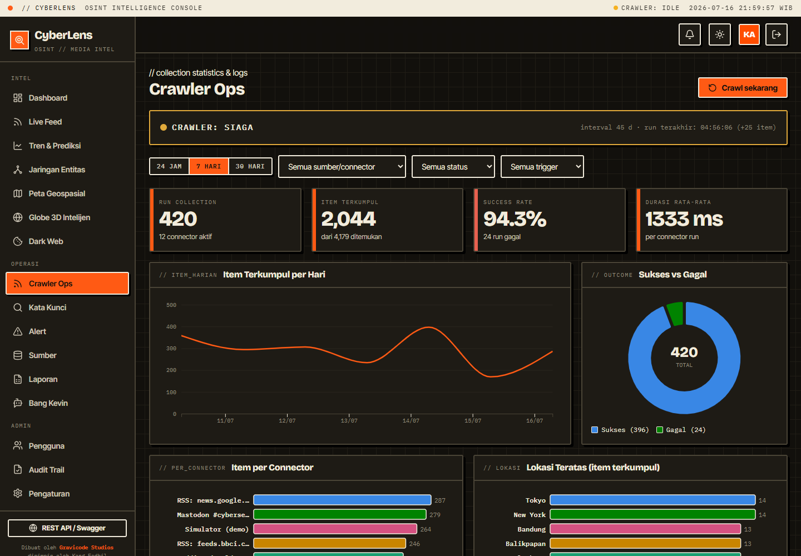

# Data collection & Crawler Ops

CyberLens collects from real sources on a schedule and on demand, logs every connector run, and shows live status. Manage it from the **Crawler Ops** page (`/crawler`) and **Settings**.

## Connectors

One collection pass runs every enabled connector; each is logged as a `CrawlRun`.

| Connector | Type | Credentials | Notes |
|-----------|------|-------------|-------|
| **RSS/Atom feeds** | News | none | Real. Ships with 20 Indonesian feeds — 8 nasional (Antara, Google News ID, CNN Indonesia, Tempo, CNBC Indonesia, Okezone, Detik, Sindonews) + 12 media daerah (Radar Bandung/Cirebon/Banten/Pekalongan/Makassar/Ambon, Jabar Ekspres, Berita Jatim, Harian Bhirawa, Waspada Medan, Riau Pos, Sumsel Update); add your own in Settings. |
| **Reddit** | Forum | none | Real. Public JSON API (`/r/{sub}/new.json`); configure subreddits. OFF by default. |
| **Mastodon** | Social | none | Real. Public hashtag timelines; configure instance + hashtags. OFF by default. |
| **YouTube** | Social | API key | Real. YouTube Data API v3 `search.list`. Set the API key + search terms. |
| **Twitter / X** | Social | Bearer token | Real. X API v2 recent search. Set the App Bearer token + search terms. |
| **Facebook** | Social | Access token | Real. Graph API page feed. Set a Page token + Page IDs. |
| **Threads** | Social | Access token | Real. Threads Graph API. Set the access token + user id. |
| **TikTok** | Social | Client key/secret | Real. Official TikTok API (client-credentials + video query); needs an approved developer app. |
| **Dark Web** | Dark Web | Tor proxy / API key | Real. Fetches configured `.onion` pages through a Tor SOCKS5 proxy, and/or a threat-intel JSON feed. See below. |

### Dark web monitoring

The `DarkWebConnector` does real dark-web collection two ways (configure in **Settings → Dark Web**):

- **`.onion` via Tor** — set `TorProxy` (default `socks5://127.0.0.1:9050`, requires a running Tor client) and list `OnionUrls`. Pages are fetched through the SOCKS5 proxy (.NET `SocketsHttpHandler` + `WebProxy`), scraped to text, and stored as dark-web items (threat-flagged).
- **Threat-intel feed** — set `ThreatIntelApiUrl` (+ optional `ThreatIntelApiKey`) to pull a clearnet JSON feed of leaks/pastes; the connector maps common field names (title/content/url/date) generically.

Disabled by default. Without Tor running, the `.onion` fetch simply fails and is logged — no crash. Real findings appear once this connector is configured.

**All social/forum connectors are OFF by default** — collection only runs the Indonesian RSS/Atom feeds and keyword searches. Reddit, Mastodon, YouTube, Twitter/X, Facebook, Threads, and TikTok can be enabled manually in **Settings → Media Sosial** when actually needed (Reddit/Mastodon need no keys; the API-keyed platforms stay idle until you provide credentials). On a manual run, unconfigured-but-enabled connectors are logged as "Kredensial belum diatur" so you can see what still needs keys.

### Kata kunci = pencarian otomatis

Every **active** watch keyword (Kata Kunci page) is searched automatically on each crawl cycle via **Google News Indonesia** (`news.google.com/rss/search?q=…&hl=id&gl=ID&ceid=ID:id`) — no API key needed. Each keyword appears as its own connector (`Keyword: <term>`) in the activity log, and its hits raise real-time alerts.

Every item — from any connector — is normalized, de-duplicated by content hash, sentiment-scored, auto-classified, tagged, and geocoded (a lightweight geocoder assigns coordinates when a known city is mentioned, so real items still appear on the maps and 3D globe).

## Batas volume data (anti-bengkak / anti-konflik)

To keep the database lean and avoid lock/token conflicts (SQLite `database is locked`, slow queries, oversized AI context), collection is bounded by `CrawlerConfig` limits — all editable in **Settings → Crawler**:

| Setting | Default | Effect |
|---------|---------|--------|
| `MaxItemsPerFeed` | `15` | only the newest N items are taken from each feed/connector per cycle |
| `MaxNewPostsPerCycle` | `200` | hard cap on NEW posts stored per cycle; remaining feeds are skipped until the next cycle (active keywords get priority) |
| `MaxContentLength` | `2000` | article text is truncated to N characters before storage |
| `RetentionDays` | `30` | posts older than N days are deleted automatically each cycle (`0` = keep forever) |
| `MaxCrawlRunsToKeep` | `500` | the activity log keeps only the newest N rows; oldest are trimmed |

SQLite runs in **WAL mode** with a 30-second busy timeout (set in `Program.cs` / `DbSeeder`), so the crawler, alert monitor, and report scheduler can write concurrently without "database is locked" errors.

## Mode: Dalam Negeri vs Luar Negeri

`Crawler.Mode` (Settings → Crawler) controls the geographic scope of collection:

- **Dalam Negeri** (default) — only Indonesian news. Well-known international outlets (e.g. BBC World) in the RSS feed list are skipped entirely, and every collected item is filtered to Indonesian-language content before it is stored. Foreign platform posts (e.g. Reddit `worldnews`) are dropped too.
- **Luar Negeri** — everything: Indonesian + global news/social content.

The filter is applied inside `CollectorService`, so scheduled runs and the manual **Crawl sekarang** button behave identically. The filter only affects *new* items — data already in the database is untouched.

## Scheduled vs manual

- **Scheduled**: the background `CrawlerService` runs a pass every `Crawler.IntervalSeconds` (default 120s) while `Crawler.Enabled` is true.
- **Manual**: the **Crawl sekarang** button (Crawler Ops and Sources pages, Analyst/Admin) runs a pass immediately.

Both share one code path (`CollectorService`), so behavior is identical.

## Running indicator

Two live indicators show whether collection is happening:

- The **classification strip** (top bar) shows `CRAWLER: RUNNING / IDLE / OFF` with a colored dot (green = running, amber = idle, red = disabled). Click it to open Crawler Ops.
- The **status banner** on Crawler Ops shows the current state, the connector being processed, the interval, the last run time and item count, and the estimated next run.

Both update in real time via `CrawlerStatusService` (no refresh needed).

## The dashboard

- **Stat cards**: runs, items collected (added / found), success rate, average duration.
- **Charts**: items collected per day, success vs failed donut, items per connector, top locations of collected items.
- **Filters**: period (24h / 7d / 30d), connector/source, status (success/failed), trigger (scheduled/manual).
- **Activity log table**: time, connector, kind, trigger, found/new/duplicate counts, duration, and status (hover a failed row for the error).

## Configuration

All connector settings and credentials live in `config/cyberlens.settings.json` under `Social`, editable in **Settings** (Admin). See [configuration.md](configuration.md). Changes apply on the next pass — no restart needed.

---

Dibuat oleh **Gravicode Studios**, dipimpin oleh **Kang Fadhil**.
